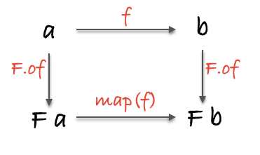

## Chapter 1: What ever we are doing?
In order to be able to understand the following chapters, we must have some idea about what makes a program **functional**.

We need a **clear** bullseye to hurl our code at, some celestial compass for when the waters get rough.

> Don't despair - throughout this book, we'll sprinkle in some `category` theory, `set` theory, and `lambda calculus` and write real world examples that achieve the same elegant simplicity and results as our flock of seagulls example. You needn't be a mathematician either. It will feel natural and easy.
>
> obey the laws of math.
> 
> (we'll go over the precise definition of "imperative" later in the book, but for now consider it anything other than functional programming). The payoff of working within a principled, mathematical framework will truly astound you.

## Chapter 2: First Class Functions

尽可能少使用`this` in js.
如果为了`this`能提高性能而是用, 还是合上这本书吧.

## Chapter 3: Pure Happiness with Pure Functions
> A pure function is a function that, given the same input, will always return the same output and does not have any observable side effect.
```js
var xs = [1, 2, 3, 4, 5];

// pure
xs.slice(0, 3);
//=> [1, 2, 3]

xs.slice(0, 3);
//=> [1, 2, 3]


// impure
xs.splice(0, 3);
//=> [1, 2, 3]

xs.splice(0, 3);
//=> [4, 5]

// impure
var minimum = 21;

var checkAge = function(age) {
  return age >= minimum;
};


// pure
var checkAge = function(age) {
  var minimum = 21;
  return age >= minimum;
};
```
### Side Effect

> It is not that we're forbidden to use them, rather we want to contain them and run them in a controlled way. We'll learn how to do this when we get to *functors* and *monads* in later chapters, but for now, let's try to keep these insidious functions *separate* from our pure ones.

Of course, you might want to calculate instead of hand writing things out, but this illustrates a different way to think about functions.
```js
var toLowerCase = {
  'A': 'a',
  'B': 'b',
  'C': 'c',
  'D': 'd',
  'E': 'e',
  'F': 'f',
};

toLowerCase['C'];
//=> 'c'
```
> Here comes the dramatic reveal: Pure functions are mathematical functions and they're what functional programming is all about. Programming with these little angels can provide huge benefits. Let's look at some reasons why we're willing to go to great lengths to preserve purity.

### The case for purity
#### Cacheable(缓存)
```js
var squareNumber = memorize(function(x) {
  return x * x;
});

squareNumber(4);
//=> 16

squareNumber(4); // returns cache for input 4
//=> 16
```
#### Portable / Self-Documenting
```js
//pure
var signUp = function(Db, Email, attrs) {
  return function() {
    var user = saveUser(Db, attrs);
    welcomeUser(Email, user);
  };
};

var saveUser = function(Db, attrs) {
    ...
};

var welcomeUser = function(Email, user) {
    ...
};
```
> Contrary to "typical" methods and procedures in imperative programming rooted deep in their environment via state, dependencies, and available effects, pure functions can be run anywhere our hearts desire.
>
> When was the last time you copied a method into a new app? One of my favorite quotes comes from **Erlang** creator, Joe Armstrong: "The problem with object-oriented languages is they’ve got all this implicit environment that they carry around with them. You wanted a banana but what you got was a gorilla holding the banana... and the entire jungle".

## Chapter 4: Curry
Giving a function fewer arguments than it expects is typically called **partial** application.

> higher order functions(Higher order function: A function that takes or returns a function).

```js
var _ = require('ramda');

// Exercise 1
//==============
// Refactor to remove all arguments by partially applying the function.

var words = function(str) {
  return _.split(' ', str);
};

// =>
var words = _.split(' ');

// Exercise 1a
//==============
// Use map to make a new words fn that works on an array of strings.

var sentences = undefined;

// =>
var sentences = _.map(words);


// Exercise 2
//==============
// Refactor to remove all arguments by partially applying the functions.

var filterQs = function(xs) {
  return _.filter(function(x) {
    return match(/q/i, x);
  }, xs);
};

// =>
var filterQs = _.filter(match(/q/i));
```

## Chap 5: Coding by Composing
### 函数饲养
> **Composition** feels like function husbandry. You, breeder of functions.(函数饲养员)
```js
var toUpperCase = function(x) {
  return x.toUpperCase();
};
var exclaim = function(x) {
  return x + '!';
};
var shout = compose(exclaim, toUpperCase);

shout("send in the clowns");
//=> "SEND IN THE CLOWNS!"
```
通过left direction, 代理函数的嵌套:

```js
// 结合律（associativity）
var associative = compose(f, compose(g, h)) == compose(compose(f, g), h);
// true
```
> compose 小管道s => 长管道
> 结合律的一大好处是, 函数可任意拆分/组合.

### PointFree
```js
// 非 pointfree，因为提到了数据：word
var snakeCase = function (word) {
  return word.toLowerCase().replace(/\s+/ig, '_');
};

// pointfree
var snakeCase = compose(replace(/\s+/ig, '_'), toLowerCase);
```
> pointfree 模式能够帮助我们减少不必要的命名，让代码保持简洁和通用。
>
> pointfree 是非常好的石蕊试验，因为它能告诉我们一个函数是否是接受输入返回输出的小函数。比如，while 循环是不能组合的。
>
> pointfree 就像是一把双刃剑，不能使用的时候就用普通函数。

### Debug (实用)
> 在管道中的某一点, 输出数据流到这里的Value(是否是后续管道需要的)
```js
var trace = curry(function(tag, x){
  console.log(tag, x);
  return x;
});

var dasherize = compose(join('-'), toLower, trace("after split"), split(' '), replace(/\s{2,}/ig, ' '));
// after split [ 'The', 'world', 'is', 'a', 'vampire' ]
```

### Category theory (范畴学)
在范畴学中，有一个概念叫做...范畴。有着以下这些组件（component）的搜集（collection）就构成了一个范畴：
- objects(对象)的搜集
- morphisms(态射)的搜集
- 态射的组合
- identity 这个独特的态射

#### identity 这个独特的态射
```js
var id = function(x){ return x; };

// id 函数跟组合一起使用简直完美。下面这个特性对所有的一元函数（unary function）（一元函数：只接受一个参数的函数） f 都成立：
// identity
compose(id, f) == compose(f, id) == f;
// true
```
# 组合像一系列管道那样把不同的函数联系在一起，数据就可以也必须在其中流动

## Chap 6: Example Application
```js
// map's composition law
var law = compose(map(f), map(g)) === map(compose(f, g));
```
> 我们已经见识到如何在一个小而不失真实的应用中运用新技能了，也已经使用过函数式这个“数学框架”来推导和重构代码了。但是异常处理以及代码分支呢？如何让整个应用都是函数式的，而不仅仅是把破坏性的函数放到命名空间下？如何让应用更安全更富有表现力？这些都是本书第 2 部分将要解决的问题。

## Chap 7:  Hindley-Milner and Me
> 刚接触函数式编程的人很容易深陷类型签名（type signatures）的泥淖。类型（type）是让所有不同背景的人都能高效沟通的元语言。很大程度上，类型签名是以 “Hindley-Milner” 系统写就的
>
> 类型签名不但可以用于编译时检测（compile time checks），还是最好的文档。所以类型签名在函数式编程中扮演着非常重要的角色——重要程度远远超出你的想象。+
>
### Tales from the cryptic (神秘的传奇故事)
```js
//  strLength :: String -> Number
var strLength = function(s){
  return s.length;
}

//  match :: Regex -> (String -> [String])
var match = curry(function(reg, s){
  return s.match(reg);
});

//  onHoliday :: String -> [String]
var onHoliday = match(/holiday/ig);
```

```js
//  id :: a -> a
var id = function(x){ return x; }

//  map :: (a -> b) -> [a] -> [b]
var map = curry(function(f, xs){
  return xs.map(f);
});
```

### Narrowing the possibility(缩小可能性范围)

### Free as in the Theory (自由定理)
(暂未理解)
```js
// head :: [a] -> a
compose(f, head) == compose(head, map(f));

// filter :: (a -> Bool) -> [a] -> [a]
// map(f) 在 filter(compose(p, f)), 已经隐含执行了?
compose(map(f), filter(compose(p, f))) == compose(filter(p), map(f));
```

## Chap 8: Tupperware
> 但是，控制流（control flow）、异常处理（error handling）、异步操作（asynchronous actions）和状态（state）呢？还有更棘手的作用（effects）呢？本章将对上述这些抽象概念赖以建立的基础作一番探究。

### 强大的容器
```js
var Container = function(x) {
  this.__value = x;
}

Container.of = function(x) { return new Container(x); };
```
Some rules:
- `Container` 是个只有一个属性的对象。尽管容器可以有不止一个的属性，但大多数容器还是只有一个。我们很随意地把 Container 的这个属性命名为 `__value`。
- `__value` 不能是某个特定的类型，不然 Container 就对不起它这个名字了。
- 数据一旦存放到 `Container`，就会一直待在那儿。我们可以用 .__value 获取到数据，但这样做有悖初衷。

### First Functor

(态射?)
```js
Container.prototype.map = function(f){
  return Container.of(f(this.__value))
}
```
用法
```js
Container.of(2).map(function(two){ return two + 2 })
//=> Container(4)


Container.of("flamethrowers").map(function(s){ return s.toUpperCase() })
//=> Container("FLAMETHROWERS")
```

等等，如果我们能一直调用 map，那它不就是个组合（composition）么！这里边是有什么数学魔法在起作用？是 functor。各位，这个数学魔法就是 functor。
> functor 是实现了 map 函数并遵守一些特定规则的容器类型。
没错，`functor` 就是一个签了合约的接口。
# 容器(Functor): 函数使用者(主动权)
好处是`抽象`，对于函数运用的抽象。当`map`一个函数的时候，我们请求容器来运行这个函数。不夸张地讲，这是一种十分**强大**的理念。

### Maybe
```js
Maybe.prototype.map = function(f) {
  return this.isNothing() ? Maybe.of(null) : Maybe.of(f(this.__value));
}
```

`map`完全有能力以`curry`函数的方式来“代理”任何functor：
```js
//  map :: Functor f => (a -> b) -> f a -> f b
var map = curry(function(f, any_functor_at_all) {
  return any_functor_at_all.map(f);
});
```
> 见下`map`使用, 先接受函数, 返回一个操作Functor(容器的)函数

### Use cases
```js
//  safeHead :: [a] -> Maybe(a)
var safeHead = function(xs) {
  return Maybe.of(xs[0]);
};

var streetName = compose(map(_.prop('street')), safeHead, _.prop('addresses'));

streetName({addresses: []});
// Maybe(null)

streetName({addresses: [{street: "Shady Ln.", number: 4201}]});
// Maybe("Shady Ln.")
```

### 释放容器里的值
如果我们想返回一个自定义的值然后还能继续执行后面的代码的话，是可以做到的；要达到这一目的，可以借助一个帮助函数`maybe`
```js
//  maybe :: b -> (a -> b) -> Maybe a -> b
// x是一个默认值, f是态射, m是`functor`
var maybe = curry(function(x, f, m) {
  return m.isNothing() ? x : f(m.__value);
});
```
> maybe 使我们得以避免普通 map 那种命令式的 if/else 语句：if(x !== null) { return f(x) }。
>
> Maybe 能够非常有效地帮助我们增加函数的安全性。

### “纯”错误处理
```js
var Left = function(x) {
  this.__value = x;
}

Left.of = function(x) {
  return new Left(x);
}

Left.prototype.map = function(f) {
  return this;
}

var Right = function(x) {
  this.__value = x;
}

Right.of = function(x) {
  return new Right(x);
}

Right.prototype.map = function(f) {
  return Right.of(f(this.__value));
}
```
> 说出来可能会让你震惊，throw/catch 并不十分“纯”。当一个错误抛出的时候，我们没有收到返回值，反而是得到了一个警告！

#### Lift
> 尽管 fortune 使用了 Either，它对每一个 functor 到底要干什么却是毫不知情的。前面例子中的 finishTransaction 也是一样。通俗点来讲，一个函数在调用的时候，如果被`map`包裹了，那么它就会从一个非`functor函数`转换为一个 `functor函数`.我们把这个过程叫做 lift。一般情况下，普通函数更适合操作普通的数据类型而不是容器类型，在必要的时候再通过 lift 变为合适的容器去操作容器类型。这样做的好处是能得到更简单、重用性更高的函数，它们能够随需求而变，兼容任意 functor。

### Old McDonald had Effects(王老先生有作用)
```js
// IO
// chap8.js
var IO = function(f) {
  this.unsafePerformIO = f;
};

IO.prototype.map = function(f) {
  return new IO(_.compose(f, this.unsafePerformIO));
};
```
> 当调用 IO 的 map 的时候，我们把传进来的函数放在了 map 函数里的组合的最末端（也就是最左边），反过来这个函数就成为了新的 IO 的新 __value，并继续下去。传给 map 的函数并没有运行，我们只是把它们压到一个“运行栈”的最末端而已，一个函数紧挨着另一个函数，就像小心摆放的多米诺骨牌一样，让人不敢轻易推倒。
>
> 有件事困扰我很久了，现在我必须得说出来：IO 的 __value 并不是它包含的值，也不是像两个下划线暗示那样是一个私有属性。__value 是手榴弹的弹栓，只应该被调用者以最公开的方式拉动。为了提醒用户它的变化无常，我们把它重命名为 unsafePerformIO 看看。
> 
> IO 会成为一个忠诚的伴侣，帮助我们驯化那些狂野的非纯操作。下一节我们将学习一种跟 IO 在精神上相似，但是用法上又千差万别的类型。

### 异步任务
我们必须调用`fork`方法才能运行`Task`，这种机制与`unsafePerformIO`类似。
```js
var fs = require('fs');

//  readFile :: String -> Task(Error, JSON)
var readFile = function(filename) {
  return new Task(function(reject, result) {
    fs.readFile(filename, 'utf-8', function(err, data) {
      err ? reject(err) : result(data);
    });
  });
};

```

### 一点理论
`functor`的概念来自范畴学
```js
// identity
// id接受任何functor都会返回其本身
map(id) === id;

// composition
compose(map(f), map(g)) === map(compose(f, g));
```
在范畴学中，`functor`接受一个范畴的对象和`态射（morphism）`，然后把它们映射`（map）`到另一个范畴里去。

# `F a`: 表示的是Functor`F`(容器), 其`__value`属性值为`a`

比如，Maybe 就把类型和函数的范畴映射到这样一个范畴：即每个对象都有可能不存在，每个态射都有空值检查的范畴。
> `态射(morphism)`是指`f`函数
>
> Lift: 
>
> `a -> b`直接使用`f`, `map(f)`本质是把态射`f`传递给`Functor F`使用.)




这张图除了能表示态射借助`functor F`完成从一个范畴到另一个范畴的映射之外，我们发现它还符合交换律，也就是说，顺着箭头的方向往前，形成的每一个路径都指向同一个结果。
```js
//  topRoute :: String -> Maybe(String)
var topRoute = compose(Maybe.of, reverse);

//  bottomRoute :: String -> Maybe(String)
var bottomRoute = compose(map(reverse), Maybe.of);

topRoute("hi");
// Maybe("ih")

bottomRoute("hi");
// Maybe("ih")
```

functor 也能嵌套使用：
```js
var nested = Task.of([Right.of("pillows"), Left.of("no sleep for you")]);

// 第一个map拿到`Task Functor`的`value`
// 第二个map拿到数组的每个元素`Right Functor`, `Left Functor`
// 第三个map对`Right, Left`传入态射`toUpperCase`
// map一次就打开一次`Functor`
map(map(map(toUpperCase)), nested);
// Task([Right("PILLOWS"), Left("no sleep for you")])
```

## Chap 9: Monad
### pointed functor
真实情况是，of 方法不是用来避免使用 new 关键字的，而是用来把值放到默认最小化上下文（default minimal context）中的。是的，of 没有真正地取代构造器——它是一个我们称之为 pointed 的重要接口的一部分。
> pointed functor 是实现了 of 方法的 functor。

这里的关键是把任意值丢到容器里然后开始到处使用 map 的能力。

### 混合比喻
我说过`monad`像洋葱(嵌套的Functor)，那是因为当我们用`map`剥开嵌套的 functor 以获取它里面的值的时候，就像剥洋葱一样让人忍不住想哭。不过，我们可以擦干眼泪，做个深呼吸，然后使用一个叫作 join 的方法。

```js
var mmo = Maybe.of(Maybe.of("nunchucks"));
// Maybe(Maybe("nunchucks"))

mmo.join();
// Maybe("nunchucks")
```

```js
Maybe.prototype.join = function() {
  return this.isNothing() ? Maybe.of(null) : this.__value;
}
IO.prototype.join = function() {
  return this.unsafePerformIO();
}
//  join :: Monad m => m (m a) -> m a
var join = function(mma){ return mma.join(); }
```

如果有两层相同类型的嵌套，那么就可以用`join`把它们压扁到一块去。这种结合的能力，functor 之间的联姻，就是`monad`之所以成为`monad`的原因。来看看它更精确的完整定义：
> monad 是可以变扁（flatten）的 pointed functor。

`join`只解决了一层嵌套.

### chain 函数 (执行一次, mapy一次, join一次, 剥开一层Functor)
你可能已经从上面的例子中注意到这种模式了:
> 我们总是在紧跟着`map`的后面调用`join`。让我们把这个行为抽象到一个叫做`chain`的函数里。

```js
//  chain :: Monad m => (a -> m b) -> m a -> m b
var chain = curry(function(f, m){
  return m.map(f).join(); // 或者 compose(join, map(f))(m)
});
```

`chain`叫做`>>=`读作`bind`）或者`flatMap`
我们用`chain`重构下上面两个例子: 
```js
// map/join
var firstAddressStreet = compose(
  join, map(safeProp('street')), join, map(safeHead), safeProp('addresses')
);

// chain
var firstAddressStreet = compose(
  chain(safeProp('street')), chain(safeHead), safeProp('addresses')
);
```

我把所有的`map/join`都替换为了`chain`，这样代码就显得整洁了些。整洁固然是好事，但`chain`的能力却不止于此——它更多的是龙卷风而不是吸尘器。因为`chain`可以轻松地嵌套多个作用，因此我们就能以一种纯函数式的方式来表示序列（sequence）和变量赋值（variable assignment）。
> 注意: IO.of接受的是一个值`x`, 生成`unsafePerform`, new IO(f)接收的`f`就是`unsafePerfrom`

# chain的本质是传递给Functor一个f, 让其执行后, 开瓶取值:
# 如果f接受Functor的__value执行后, 返回了一个新的`Functor`那就形成了嵌套, 所以join开瓶
# .chain之所以能链式调用, 是利用了解释性语言的优势, 默认开瓶的返回值是一个有chain方法的Functor.

```js
// getJSON :: Url -> Params -> Task JSON
// querySelector :: Selector -> IO DOM

getJSON('/authenticate', {username: 'stale', password: 'crackers'})
  .chain(function(user) {
    return getJSON('/friends', {user_id: user.id});
});
// Task([{name: 'Seimith', id: 14}, {name: 'Ric', id: 39}]);

// 理解困难: 
querySelector("input.username").chain(function(uname) {
  return querySelector("input.email").chain(function(email) {
    return IO.of(
      "Welcome " + uname.value + " " + "prepare for spam at " + email.value
    );
  });
});
// IO("Welcome Olivia prepare for spam at olivia@tremorcontrol.net");


Maybe.of(3).chain(function(three) {
  return Maybe.of(2).map(add(three));
});
// Maybe(5);


Maybe.of(null).chain(safeProp('address')).chain(safeProp('street'));
// Maybe(null);
```

#### chain总结: 总之记住，返回的如果是“普通”值就用 map，如果是 functor 就用 chain。

