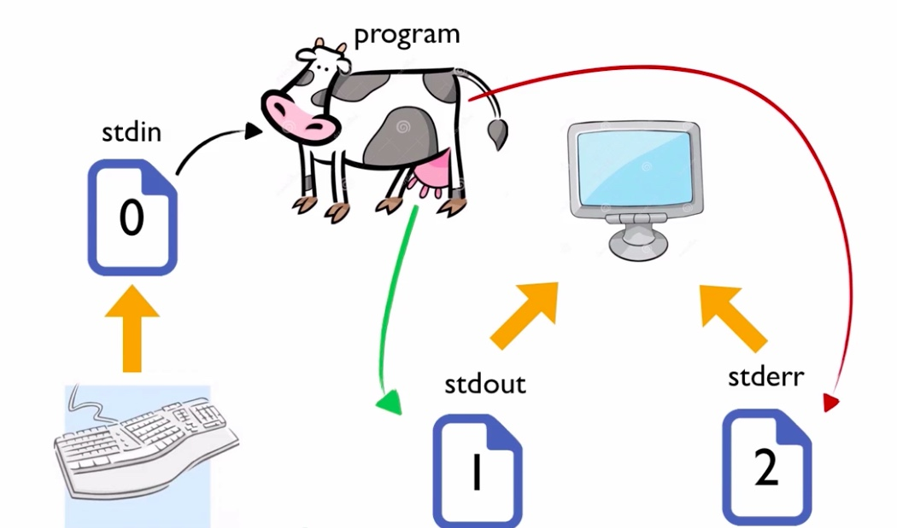
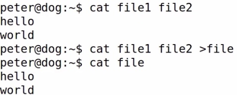
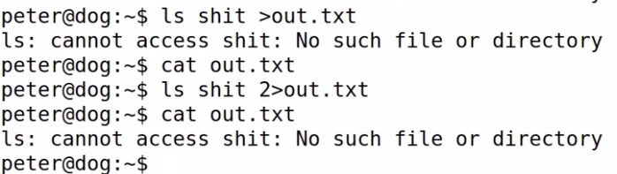
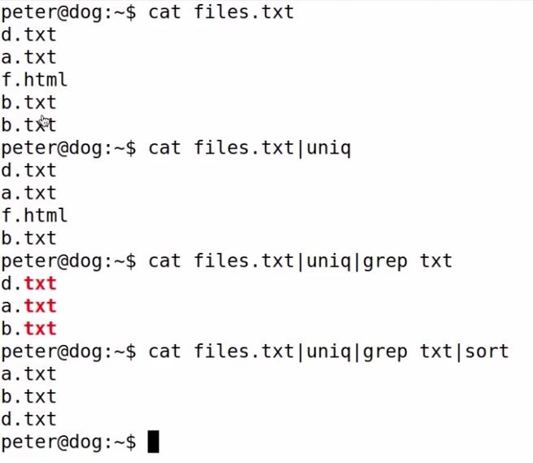
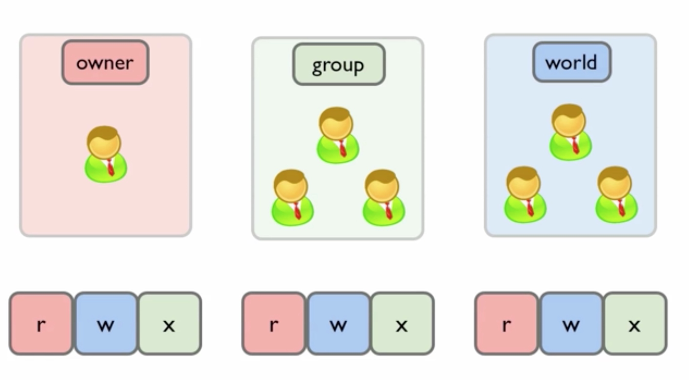
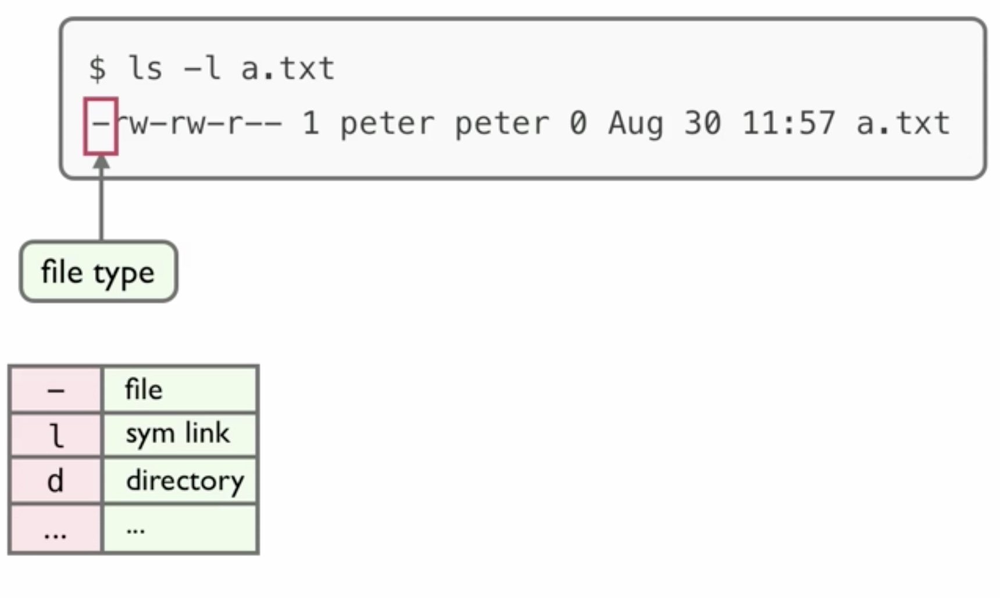
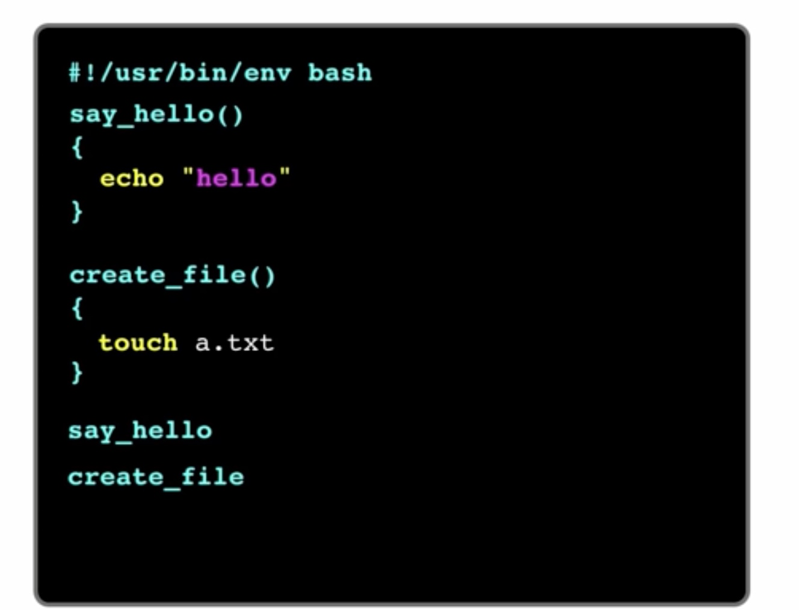

### 变量默认都是字符串。
## 4.操作文件和目录
### 4.1文件操作

```shell
#cp
cp file1 file2
cp -r dir1 dir2
#move
mv file
#rename
mv file1 file2
#remove
rm file
rm -r dir

#创建文件
touch a.txt
> a.txt #重定向符
vim a.txt

#创建目录
mkdir

#查看文件
cat file
#查看文件类型
file a.txt
```
###4.3打包压缩
```shell

## zip
unzip file.zip
zip -r file.zip beZippedDir

# tar.gz
tar zxvf file.tar.gz #extraction
tar zcvf file.tar.gz dirName # compression

##tar.bz2
tar jxvf file.tar.bz2 #解压
tar jcvf file.tar.bz2 dirName #压缩
```

### 5.1 linux重定向
```shell
1. 三种文件: linux下一切皆文件.
- 0 标准输入
- 1 标准输出
- 2 错误输出

2. 拐弯的方式
> 输出重定向(每次重定向之前都把文件清空); 追加信息用 >>
>2 标准错误输出

3.管道线
|    (linux CLI哲学的基石)
```

cat 连接文件内容

标准错误输出

管道符


##6.用户和文件权限
### 6.0引言
- power用户在`/home/power`下是有写权限的,其他目录就没有.
- 安装软件就是向用户主目录以外的地方去写文件.
### 6.1三种权限
- r,w,x 读,写,执行
- 根据对文件权限的不同,可以分为三类:owner,group,world


```shell
ls -l
```

上图中:
- `1`表示link的数量
- 第一个`peter`表示owner;
- 第二个`peter`表示group;
- 后面的`0`表示文件大小;
- `Aug 30 11:57`最后修改时间
- `rw-rw-r--`表示file-mode

```shell
ls -ld . #查看.目录权限
chmod +w . #对当前目录添加w权限
#对文件夹有 w 权限,才能对里面文件进行create/delete/rename

#file 有 x 权限,表示可以执行,否则不可;dir有执行权限,表示可以cd 进入,否则不可。
```


##7.进程
###7.1获取进程号
`ps aux|grep vim`查看所以进程(process)
###7.2后台执行
`node` 后台执行程序
`<C-z>` suspend挂起
`bg` 重新进入
`fg` 回到前台
`<C-c>` 结束进程
###7.3kill
`kill -15`默认
`kill -2` 中断和`<C-c>`一样
`kill -9` 程序已经出现异常,强制关闭。

`exit` 相当于`C-d`


##8.搜索
### 8.1locate 全局查找
locate file
#locate是从数据库中读数据,数据每天updatedb更新一次,所有新建的file有时看不到。

### 8.2find 目录
### 8.3grep


###9.网络操作
1. ssh 登陆后,`ctrl+d`退出.
2. 上传`rsync -r dirname power@saber.xin:` (dirname不能有/,否则会把,host必有有冒号,不指定路径 默认放到remote HOME目录)
3. 下载`rsync -r power@saber.xin: .`
4. 同步`rsync -r dirname/ power@saber.xin:dirname/`(/都不能少)

###10.软件安装
1.查看系统环境变量`$PATH`
`ln -s $ /path_to_sh /bin/sh_name` (可执行程序放到$PATH中,即可成为系统命令.)
1.1.安装开源软件三步:
- ./configure
- make
- sudo make install
2.deb包
3.apt 包仓库

###11.shell脚本编程
1.指定解析器
- `#!/usr/bin/env bash` 第一行指明解析器
- `#!/usr/bin/env python`
2.语句即命令
- 脚本语句对空格变态敏感.
3.位置参数
4.脚本不在当前shell执行
- 默认是后台开一个shell来执行的.`source xxx.sh`
5.循环控制
6.远程执行
7.确认执行
8.其他语言脚本

