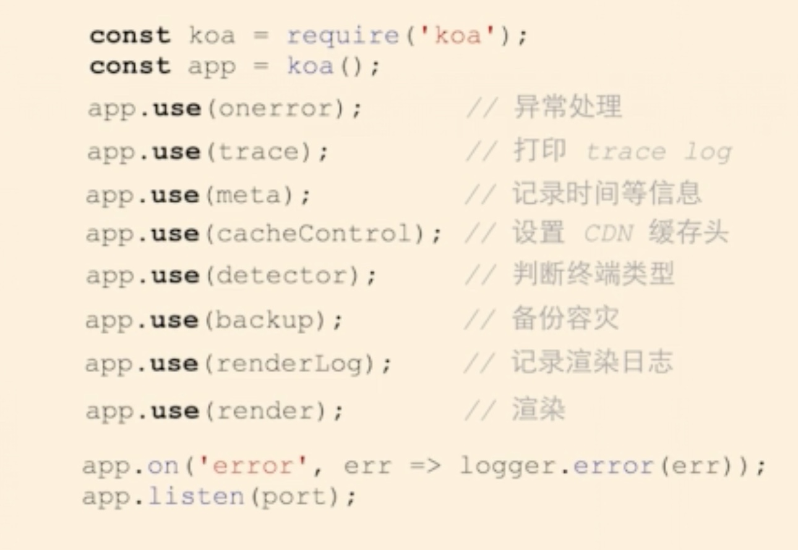

### Koa Url
```node
ctx.href:  http://localhost:8088/octopus/login.fields.query/v1?partner_code=crawltest
ctx.originalUrl:  /octopus/login.fields.query/v1?partner_code=crawltest
ctx.path:  /octopus/login.fields.query/v1
ctx.querystring:  partner_code=crawltest
```

### Koa AliD2-2015-不四

express:
- express middleware是顺序执行
- 无法对已经发送的body进行修改
- 不能在发送body后设置响应头

koa:
- koa middleware是包裹所有后续中间件的`装饰器`.
- 在所有middleware执行完成后再发送响应,
- 中间件执行过程中可以对body和header进行任意修改



为什么不用pm2?
- 因为它本身就是master起起来的.
- pm2代码比本身代码都要大.
- 但是否更稳定?

日志:
- 所有的请求都是accesslog追踪
- 所有的异常统一记录,并分类输出.
- 依赖系统调用tracelog,记录请求和响应情况.

监控:
- 系统状态:CPU/内存/Load/磁盘空间
- 服务状态: 响应时间/QPS
- 依赖服务状态:

告警:
- 系统/服务状态异常: RT增高/Load增高/``
- 依赖异常: 调用失败/调用超时
- 服务异常: 异常日志

- 快速感知(告警)
- 快速定位(监控 日志)
- 目的是快速恢复

合理利用CDN
- 绝大部分页面不需要每次请求都重新渲染
- 解决流量高峰高并发问题
- 大大节省机器成本

基于CDN的URL统一(不同终端访问同一url返回不同内容)
- 不同终端请求相同的url
- CDN识别设备类型
- 渲染服务返回不同页面

容灾和预案
-
