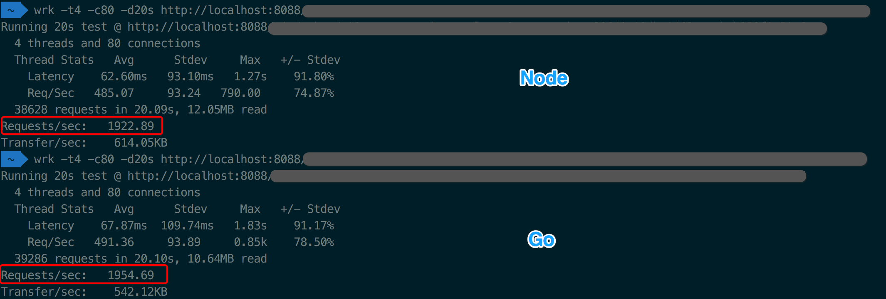

### koa & node-fetch

1. 当`ctx.body`是stream时，koa内部直接调用pipe，所以可以直接绕过koa，使用`cres.pipe(ctx.res)`

```js
if (body instanceof Stream) return body.pipe(res);
```

2. node-fetch opts中body字段，可以直接传入`sreq`
   - fetch 返回res的 `res.header.raw()` 对应原生`resp.headers`
   - fetch 返回res的 `res.body` 对应原生的 `resp`
   - fetch 返回res的 `res.status`对应原生 `resp.statusCode`


```js
// fetch 传入的opts字段会直接，传给new Request
const request = new Request(url, opts);
```

3. 在`koa.prototype`上增加 `app.get/post`，在`use`外封装一层。

#### writableStream

koa中ctx.body
node-fetch中request的body

#### readableStream
node-fetch res.body

### 性能提升



error record:
```log
3|node-ope |   code: 'ENOTFOUND',
3|node-ope |   errno: 'ENOTFOUND',
3|node-ope |   syscall: 'getaddrinfo',
3|node-ope |   hostname: 'api.shujumohe.com',
3|node-ope |   host: 'api.shujumohe.com',
3|node-ope |   port: 80 } '@@'
3|node-ope | { Error: getaddrinfo ENOTFOUND api.shujumohe.com api.shujumohe.com:80
3|node-ope |     at errnoException (dns.js:50:10)
3|node-ope |     at GetAddrInfoReqWrap.onlookup [as oncomplete] (dns.js:91:26)
3|node-ope |   code: 'ENOTFOUND',
3|node-ope |   errno: 'ENOTFOUND',
3|node-ope |   syscall: 'getaddrinfo',
3|node-ope |   hostname: 'api.shujumohe.com',
3|node-ope |   host: 'api.shujumohe.com',
3|node-ope |   port: 80 } '@@'
```
### promisify can't use in `http.request`?
```js
const requestP = Promise.promisify(http.request);
```
因为 `http.request`会返回一个 `http.clientRequest`实例.
