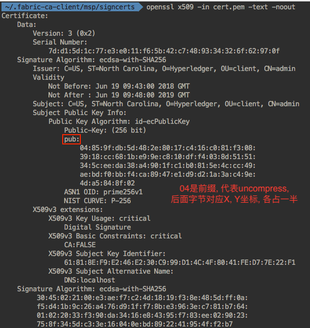
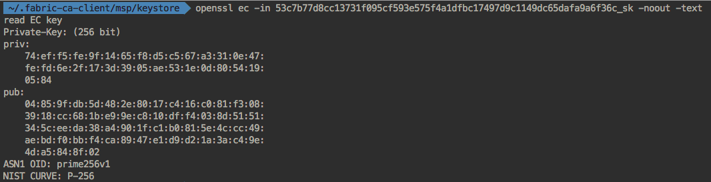
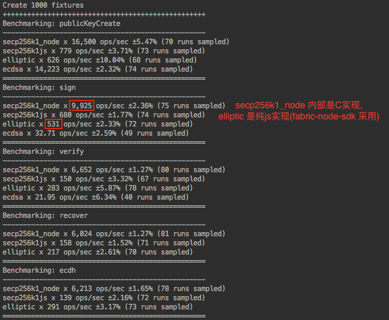

### 问题及结论

我们对 fabric 压测, 遇到了一些瓶颈, 主要总结为 3 点:

1.  ECDSA 签名速度过慢(纯签名耗时`3~4 ms`), client 端就成为了瓶颈, 达不到区块链网络的 3k 上限.
2.  `evenetHub`未复用, 导致 peer 节点压力过大而崩溃.
3.  `order, Endorser`部署在同一台虚机, 不能充分发挥出各自性能.

> 本处主要描述第一个问题的测试过程, 旨在充分发挥`node-sdk`用途, 验证一些想法.

### Fabric client 端签名介绍

1.  Fabric 中提交 proposal 使用的签名算法是 `SHA256-ECDSA`, 即对 proposal 先进行`SHA256`Hash, 对其输出的 32bytes 内容再进行真正的`ECDSA`签名.
2.  ECDSA(Elliptic Curve Digital Signature Algorithm)是一种签名算法.

- Elliptic 曲线的 Domain Parameter 有 `{ p, a, b, G, n, h }`
- 常用曲线有对应别名(如`secp256k1` etc), 每个曲线都规定了上述 5 个参数, 网址位于`http://www.secg.org/sec2-v2.pdf`
- 私钥是一个很大的数字, 取值范围是`1 ~ n-1`
- 公钥是私钥代入曲线计算得到一点坐标`(X, Y)`

### 查看 Fabric CA 颁发的证书内容

```sh
// 通常cert.pem位于peer节点 msp/signcerts 目录下
> openssl x509 -in cert.pem -text -noout
```



```sh
// 对应私钥pem文件位于 msp/keystore 目录下
> openssl ec -in 53c7b77d8cc13731f095cf593e575f4a1dfbc17497d9c1149dc65dafa9a6f36c_sk -noout -text
```



### node 下不同库, ECDSA benchmark 表现

- fabric-node-sdk 默认使用`elliptic`版本, 是纯 js 实现, 性能平常, 但支持曲线丰富
- `scep256k1`使我们压测使用的库, 性能较多, 问题是目前 fabric 使用的曲线是`secp256r1`, 其不支持.



### ECDSA 签名其他内容

#### CryptoSuite 定制

fabric-node-sdk 有一套默认的`ECDSA + SHA2/3`的实现

- 也允许开发者自己实现一个 package, 只需要把其`path`加入到 sdk 启动的配置文件中即可, 配置项是`crypto-suite-software` (`https://fabric-sdk-node.github.io/module-api.CryptoSuite.html`)

#### 相同的输入, 每次签名结果都是不同的

ECDSA 签名会输出两个变量`r, s`, 这两个都会发给验证方, 但方式不同:

- `r`是一个 `32byte` 随机数, 不会直接发给验证方, 而是计算出 `rG`后发送
- `s`是签名结果

#### DER

Fabric 是把签名内容转换成`DER`格式, 发送给接收方(peer/ca/...)的

- bitcoin 中也有 DER 相关介绍: `https://github.com/bitcoin/bips/blob/master/bip-0066.mediawiki`
- DER 的定义: `https://www.itu.int/rec/T-REC-X.690/en`

#### fabric-node-sdk 依赖

与签名相关依赖, 较多, 直出只列出主要的:

- `jsrsasign`: 做`pem`证书解析相关操作
- `elliptic`: 曲线生成, 签名的`sign`, `verify`, Key 的产生
