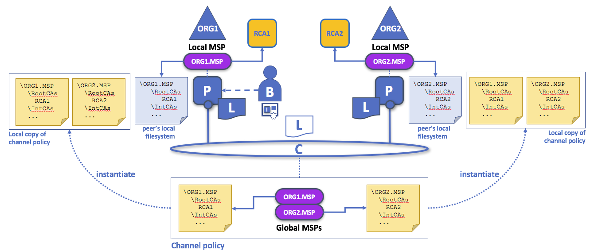

## Getting Started

* API Documentation: Fabric 本身服务搭建 API

* Hyperledger Fabric SDKs: 应用开发中(对接 Fabric 服务)所用到的 language 库.

* Hyperledger Fabric CA: 提供可选的 `certificate authority` service that you may choose to use to generate the certificates and key material to configure and manage identity in your blockchain network.

## Key Concepts

> 个人理解: Endorser(公证节点)

### Hyperledger Fabric Model

* Assets
* Chaincode
* Ledger Features - **one ledger per channel** (共享账本: 整个网络在一个 channel)
* Privacy through Channels
* Security & Membership Services
* Consensus

### Hyperledger Fabric Network (重要, 网络的建立)

> https://hyperledger-fabric.readthedocs.io/en/latest/network/network.html

图 1, 网络描述

#### Creating the Network

> 网络对应`order service`

The `ordering service` 是网络的`administration point`, 因为它包含了 channel 的配置. 主要包括:

* the policies for the channel
* the membership information (in this example X509 root certificates) for each member of the channel.

#### Defining a Consortium

A consortium 有 network 中的多个 org 组成(至少两个)

#### Creating a channel for a consortium

`Channels are created` by `generating the configuration block` on the `ordering service`

* Channels are governed by the policies they are configured with.

#### Peers and Channels

* Endorsing peer – policy 中指定的 node, 执行 cc 模拟交易, 并返回 a `proposal response` (endorsement) to client.
* Committing peer - 所有 peer 都是(因为本地都有 ledger)
* Anchor peer – 在`channel configuration` 定义, 第一个作为 org 代表在网络中被发现.
* Leading peer – 代表 org 与`order service`通信

#### Applications and Smart Contracts

app 位于 network 之外, endorsor 执行 smart contract 返回 Endorsement, app 接收到之后, 广播给`ordering service`.

### Identity

* principal(主角): like userIDs or groupIDs.

Public Key Infrastructure (PKI)两大组成:

* Certificate Authorities(CA 即 certificate issuer 证书颁发者) who issue `digital certificates` to parties
* Certificate Revocation List (CRL) 包含 a reference for the certificates .

There are four key elements to PKI:

* Digital Certificates
* Public and Private Keys
* Certificate Authorities
* Certificate Revocation Lists

#### Authentication & Public keys and Private Keys

> 公私钥的认证过程.

#### Root CAs, Intermediate CAs and Chains of Trust

> HTTPS 中, CA 颁发的证书, 包含授权者的 public key, 防止了中间人攻击.
>
> CA 的可信任程度最高.

建立了一个认证的 chain. (减少 root ca 的暴露)

#### Fabric CA

**fabric-ca** is a private root CA provider capable of managing digital identities of Fabric participants that have the form of X.509 certificates.

CA 的存在是确保`公钥`的可靠性, 防止中间人攻击. (Pc)

#### Identity 总结

* `PKI` 提供 verifiable identities through a chain of trust
* the `next step` is to see how these `identities` can be used to represent the `trusted members` of a blockchain network.
* That’s where a Membership Service Provider (`MSP`) comes into play – it identifies the parties who are the members of a given organization in the blockchain network.

### Membership

**MSP identifies which Root CAs and Intermediate CAs are trusted to define the members of a trust domain, e.g., an organization**

* 一种方式是列出其(org)members
* or by identifying which `CAs` are `authorized` to `issue` valid identities for their members

还包括:

* 识别 acotr 在指定 network 中的 role`identify specific roles an actor might play`
* 设置访问特权(eg.channel admins, readers.)
* MSP 对 all channel 是公开的

#### Mapping MSPs to Organizations

What’s most important about organizations (or orgs) is that they manage their members under a single MSP.

此处`org`概念和 X.509 中`org`不同.

#### Local and Channel MSPs

* **`Local MSPs` defined for nodes (peer or orderer) and users (administrators that use the CLI or client applications that use the SDK).**
  Every node and user must have a local MSP defined, as it defines who has administrative or participatory rights at that level and outside the context of a channel (who the administrators of a peer’s organization, for example).

* **`channel MSPs` define administrative and participatory rights at the channel level. Every organization participating in a channel must have an MSP defined for it.**



> An administrator B connects to the peer with an identity issued by RCA1 and stored in their local MSP. When B tries to install a smart contract on the peer, the peer checks its `local MSP`, ORG1-MSP, to verify that the identity of B is indeed a member of ORG1. A successful verification will allow the install command to complete successfully.
>
> Subsequently, B wishes to instantiate the smart contract on the channel. Because this is a channel operation, all organizations in the channel must agree to it. Therefore, the peer must check the `MSPs of the channel` before it can successfully commits this command. (Other things must happen too, but concentrate on the above for now.)

* **Local MSPs are only defined on the file system of the node or user to which they apply.**
* **channel MSPs are available to all nodes in the channel**
* **a channel MSP is instantiated on the file system of every node in the channel and kept synchronized via consensus.**

#### MSP Levels

* **MSPs at a higher level relating to network administration concerns**
* **while MSPs at a lower level handle identity for the administration of private resources.**


> In this figure, the network configuration channel is administered by `ORG1`, but another application channel can be managed by `ORG1 and ORG2`. The peer is a member of and managed by ORG2, whereas ORG1 manages the orderer of the figure. ORG1 trusts identities from RCA1, whereas ORG2 trusts identities from RCA2. Note that these are administration identities, reflecting who can administer these components. So while `ORG1` administers the network, ORG2.MSP does exist in the network definition.

* Network MSP
* Channel MSP
* Peer MSP
* Orderer MSP

### Peers

> 四种身份: Endorser & Commiter & Order & Consenter

ledger 和 chaincode 都在 peer 上都有一份实例. 访问 ledger 的时候, 最好通过 chaincode 编写的程序(smart contract).

`smart contracts` with a technology concept it calls `chaincode` – simply a piece of code that accesses the ledger.

#### Applications and Peers

* 通过 SDK, App 可以连接到多个 peer.

#### Peers and Channels

> it’s worth spending a little time understanding how `peers interact` with each other, and applications, via channels – a mechanism by which a set of components within a blockchain network can communicate and transact privately.

Conceptually you can think of channels as being similar to groups of friends.

可以把`channel` 看成 logical structure that is formed by a collection of physical peers.

#### Peers and Organizations

* Blockchain networks are administered by 多个 organization.

* Peers 分属不同的 organization.

* Blockchain network literally 上说是不存在的, 如果没有 organization 贡献 Resources.

* 单个 Organization 的离开或者加入并不影响 network 的存在. This is at the heart of what it means for a network to be decentralized.

#### Peers and Identity

a peer 只能隶属一个 organization, 且只能与一个 MSP 相关联.

#### Peers and Orderers

应用 update ledger 需要 3 个 phase, which ensures that all the peers in a blockchain network keep their ledgers consistent with each other.

1.  applications work with a subset of endorsing peers, each of which provide an endorsement(sign, 公证) of the proposed ledger update to the application, but do not apply the proposed update to their copy of the ledger.

2.  these separate endorsements are collected together as transactions and packaged into blocks.

3.  these blocks are distributed back to every peer where each transaction is validated before being applied to that peer’s copy of the ledger.

`orderer` nodes are central to this process.

##### Phase 1: Proposal

This `endorsement` 可用于之后证明是此 peer 签名的. eg: `if peer P1 is owned by organization Org1, endorsement E1 corresponds to a digital proof that “Transaction T1 response R1 on ledger L1 has been provided by Org1’s peer P1!”.`

##### Phase 2: Packaging

`orderers` 的工作 simple but vital:

* collecting proposed transaction updates
* ordering them
* packaging them into blocks
* ready for distribution

注意:

* package 顺序是任意的, 并不是按照接收的顺序.
* `strick mode`: same transaction 不能 package 到不同 block

##### Phase 3: Validation

peer 接收到 order 分发的新的 block, 会先对其中每一条 transaction 进行 validate:

* 成功(`endorsed by all relevant organizations`), 则 attemp apply to ledger
  * perform `ledger consistency check` to `verify` ledger 当前 state 和`proposed update` 产生时的 state 一致.
* 失败, 保留用做 audit(审计), 但不写入.

其他:

* peer 除了直连 order, 还可以通过`gossip`协议通过其他 peer 进行 block 同步.
* `chaincodes`只在 endorsing nodes 可用(phase-1)
  > This is often helpful as it keeps the logic of the chaincode confidential to endorsing organizations.

##### Orderers and Consensus

This entire transaction workflow process is called `consensus`.

### Ledger (1.1 增加)

### Chaincode for Operators

Chaincode runs in a secured Docker `container` isolated from the endorsing peer process. Chaincode `initializes` and manages ledger state through transactions submitted by applications.

#### lifecircle

`package`, `install`, `instantiate`, and `upgrade`. In a future release, we are considering adding `stop` and `start`
`invoke`

#### CLI

```sh
peer chaincode install -n mycc -v 0 -p path/to/my/chaincode/v0
peer chaincode instantiate -n mycc -v 0 -c '{"Args":["a", "b", "c"]}' -C mychannel
peer chaincode install -n mycc -v 1 -p path/to/my/chaincode/v1
peer chaincode upgrade -n mycc -v 1 -c '{"Args":["d", "e", "f"]}' -C mychannel
peer chaincode query -C mychannel -n mycc -c '{"Args":["query","e"]}'
peer chaincode invoke -o orderer.example.com:7050  --tls --cafile $ORDERER_CA -C mychannel
```

#### System chaincode

The purpose of system chaincode is to shortcut gRPC communication cost between peer and chaincode, and tradeoff the flexibility in management.

1.  LSCC Lifecycle system chaincode handles lifecycle requests described above.
2.  CSCC Configuration system chaincode handles channel configuration on the peer side.
3.  QSCC Query system chaincode provides ledger query APIs such as getting blocks and transactions.
4.  ESCC Endorsement system chaincode handles endorsement by signing the transaction proposal response.
5.  VSCC Validation system chaincode handles the transaction validation, including checking endorsement policy and multiversioning concurrency control.

## Tutorial

### Add an Org to a Channel

> https://hyperledger-fabric.readthedocs.io/en/latest/channel_update_tutorial.html

#### Prepare the CLI Environment

```sh
docker exec -it cli bash
# 在容器中执行, 需要jq
export ORDERER_CA=/opt/gopath/src/github.com/hyperledger/fabric/peer/crypto/ordererOrganizations/example.com/orderers/orderer.example.com/msp/tlscacerts/tlsca.example.com-cert.pem  && export CHANNEL_NAME=mychannel
```

#### Fetch the Configuration

```sh
peer channel fetch config config_block.pb -o orderer.example.com:7050 -c $CHANNEL_NAME --tls --cafile $ORDERER_CA
```

#### Convert the Configuration to JSON and Trim It Down

```sh
apt-get -y update && apt-get -y install jq

configtxlator proto_decode --input config_block.pb --type common.Block | jq .data.data[0].payload.data.config > config.json

# 执行结果: tutorial_data/config.json
```

#### Add the Org3 Crypto Material

```sh
jq -s '.[0] * {"channel_group":{"groups":{"Application":{"groups": {"Org3MSP":.[1]}}}}}' config.json ./channel-artifacts/org3.json > modified_config.json
```

## Operations Guides

### Channel Configuration (configtx)

#### Anatomy(剖析) of a configuration

The `mod_policy` is used to govern the required signatures to modify that element.

### Endorsement policies

`Endorsement policies` are used to instruct a peer on how to decide whether a transaction is properly `endorsed`. When a peer receives a transaction, it `invokes` the VSCC (Validation System Chaincode) associated with the transaction’s Chaincode as part of the transaction validation flow to `determine the validity of the transaction`.

## Architectur Reference

### Architecture Explained

#### 2.2. The endorsing peer simulates a transaction and produces an endorsement signature

在 1.0 架构中，一个 transaction 包括如下信息：

```
[ledger] [channel], proposal:[chaincode, ] endorsement:[proposal hash, simulation result, signature]
```

* `endorsements`: proposal hash, simulation result, signature

#### 3. Endorsement policies

> policy 规定了 transaction 执行公证所需`endorser`的最小节点数.

### Transaction Flow

### Channels

* 加入: Each peer 加入 channel, MSP 都给予其一个`Identity`

* 创建: SDK 调用 `configuration system chaincode`, 会生成`genesis block` (保存了 channel 的配置信息: channel policies, members and anchor peers)

  * 更新 config, 需要调用`configuration system CC`

* `leading peer` 需要代表 `channel 的每一个 member` 与 order service 通信

* 一个 `anchor`可以加入多个 channel, ledger data 不是共享的.

### Capability Requirements

#### Setting Capabilities

1.  2 Doc that talk through different aspects of `channel reconfigurations`.

* https://hyperledger-fabric.readthedocs.io/en/latest/channel_update_tutorial.html
* https://hyperledger-fabric.readthedocs.io/en/latest/config_update.html

个人备注:

* app 即`Commiter`
* `Endorser`通过 MSP 验证 proposal 的 signature
* each valid transaction the write sets are `committed` to current `state database`.

## Glossary (术语表)

### Anchor Peer

* bootstrap gossip communication between peers from different organizations
* 每个 org 至少有一个 anchor peer
* anchor peer address 存储在`configuration block`中

### Concurrency Control Version Check

CCVC 是 peer 之间同步 state 的一种方式.

### Configuration Block

* Contains the configuration data defining members and policies for a system chain (ordering service) or channel.
* Any configuration modifications to a channel or overall network (e.g. a member leaving or joining) will result in a new configuration block being appended to the appropriate chain.
* This block will contain the contents of the genesis block, plus the delta.

### Consortium (财团?)

* A consortium is a collection of non-orderer organizations on the blockchain network.

### Leading Peer

* communicate with the network `ordering service` on behalf of the member
* The `ordering service` “delivers” blocks to the leading peer(s) on a channel, 再分发给每个 peer.

### Member

See `Orgniztion`

### Orgnization

* organizations are invited to join the blockchain network by a `blockchain service provider`.
* An organization is `joined` to a network by adding its `MSP` to the network. (方式)
  * The `MSP` network 中的其他 member 如果 verify signatures 是否是一个有效的 Idnetity, 并由某个 org 颁发.
* A collection of organizations form a Consortium.

### Membership Service Provider

* MSP provides credentials(资格证书) to clients,
  * Clients use these credentials to authenticate their transactions
  * peers use these credentials to authenticate transaction processing results (endorsements)

### Policy

有两种策略:

* Signature
  * 策略的满足必须获得指定 user 的`签名`,such as `Org1.Peer OR Org2.Peer`
* ImplicitMeta
  * eg: `MAJORITY Admins`
  * `configtx.yaml` file under `Application: Policies` 可用于定于 network 全局的策略
  * channel 特定的策略可以定义在 channel profile section 中

### Qurey

> query 是查询 state 的 cc.

因为 query 不改变 ledger state, 所以不必发给 order, 如果 ledger 需要 auditable proof, 可以选择发送给 order.

### System Chain

* Contains a `configuration block` defining the network at a system level
* 存在于 `ordering service`中
* Any change to the overall network 都会在 system chain 之后追加一个 configuration block

## Policy

> https://hyperledger-fabric.readthedocs.io/en/latest/policies.html

bc network 的配置通过 policy 来管理. 这部分主要介绍如何 define policy, 并如何与 channel 的配置交互.

### What is a Policy?

a policy is a `function` which accepts as input a set of signed data and evaluates successfully, `or` returns an error because some aspect of the signed data did not satisfy the policy.

### Policy Types

Policies are encoded in a common.Policy message as defined in fabric/protos/common/policies.proto. They are defined by the following message:

```proto
message Policy {
    enum PolicyType {
        UNKNOWN = 0; // Reserved to check for proper initialization
        SIGNATURE = 1;
        MSP = 2;
        IMPLICIT_META = 3;
    }
    int32 type = 1; // For outside implementors, consider the first 1000 types reserved, otherwise one of PolicyType
    bytes policy = 2;
}
```

> 补充: 此处`= 0`定义的是 field number, 对应`channel-config.json`中的`"type": 1`(用的最多的是`1`和`3`)

### Configuration and Policies

The channel configuration is expressed as a hierarchy of configuration groups

* 系统中不同的组件, 对应不同的策略名, 如:
  * `Deliver` on order, 需要满足`/Channel/Readers`policy
  * gossip a block to a peer 需`/Channel/Application/Readers`policy

### 策略(个人理解)

1.  ImplicitMeta 是基于 Sign 的
2.  策略分为: 策略的定义, 交易背书策略, 链码实例化策略, 通道管理策略.
