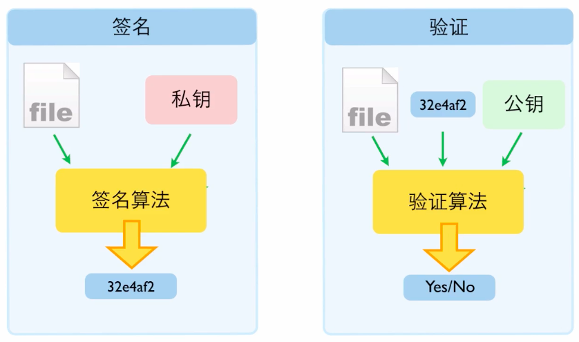
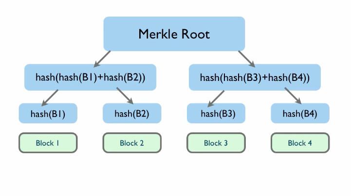

### 0

总结(05:10): 比特币是一种基于**大账本**的电子货币, 这个账本由大众协作进行维护的, 要发款的时候需要向维护者发一条信息, (数额, 出款方, 入款方), 维护者通过查看数字签名-确保这条信息确实是由账户所有者发出的. 各个维护者之间通过投票来达成一致.

### 一. 比特币的基本

#### 1.1 比特币的由来

> 哈耶克的《货币的非国家化》，去中心化的大账本。
>
> 中本聪: 开源. 之后, 2009-01-03, 发行 50 个.

#### 1.2 挖矿

比特币的本质是一个**账本**.
挖矿的本质是, 争夺**记账权**.

记账权由**投票决定**, 运算能力越强越有可能获得.

* 全网计算能力增加, 可以预防 **51%的攻击**. (因为超过全网总计算能力越来越难.)
  http://www.weusecoins./com/en/mining-guide

> 挖矿的目的最最重要的不是挖出比特币，而是去维护大账本。

#### 1.3 如何获得比特币.

> 购买，挖矿...等等获得比特币的方式介绍。

随着全网运算能力的增加, 想通过个人 PC 挖到, 很难.

国内交易网站: 火币网, eg...

#### 1.4 钱包

> bitaddress.org, 随机数生成钱包.

* 钱包**本质**: 一个收款地址(公开)和与之配对的**私钥**(保密).
* 查看: `blockchain.info/address/地址`

> 选择一款钱包应用, 导入**私钥**, 即可使用

#### 1.5 交易所购买比特币

> 火币网
> http://lixiaolai.tumblr.com/post/70183678689/%E5%A6%82%E4%BD%95%E8%AE%BE%E7%BD%AE%E8%B6%B3%E5%A4%9F%E5%AE%89%E5%85%A8%E7%9A%84%E5%AF%86%E7%A0%81

### 第二章：专题介绍 blockchain.info

#### 2.1 第一部分

> blockchain.info

* 创建 wallet, 起别名.

#### 2.2 第二部分

#### 2.3 第三部分

#### 2.4 第四部分

### 第四章. 趣味网络安全

#### 4.1 Hash(切碎, 搅拌) 算法

> eg: MD5, SHA-256, CRC

满足 Law:

* 任意长度内容 -> 固定长度 Hash
* 单向的
* 一一对应 (很难, input 是无限的, output 是有限的)

#### 4.2 数字签名

提问: 既然私钥加密, 公钥(公开)解密. 使用场景就是 **数字签名** (签署)

* 签名算法: 私钥(签名 key) -> 签名
* 验证算法: 公钥(验证 key) -> 验证

可以保证:

* 被签文件不会被改动
* 身份验证

> KHANACADEMY: Digital Signature

#### 4.3 加密通信

> 非对称加密

* 公钥加密
* 私钥解密

#### 4.4 Merkle Tree

> 是 BitCoin ,Git, BT 下载的底层技术支撑.
>
> 下载一个大 File, 通过一个 Hash 列表即可从不被信任的节点下载文件.

大文件被分成了数据块进行 HASH, Merkle Tree 可以对单独的分支进行校验.(类似 Merge Sort)

#### 4.5 p2p 网络

> 去中心化, 每个节点都可以分享数据. 任一个节点, 去掉, 都不影响整体服务.

因为版权或专利, 会被反对.
