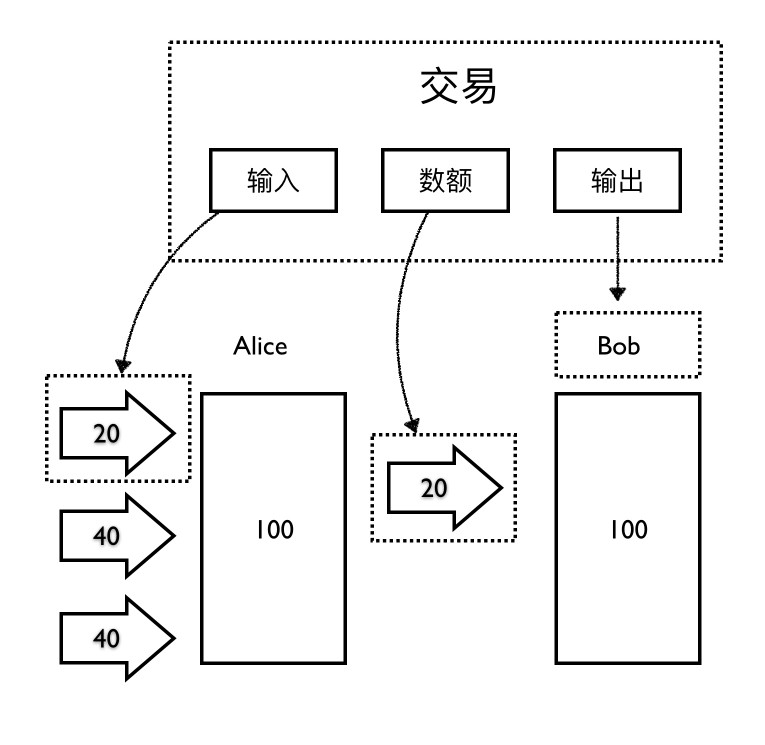

#### 1. 区块链起源

##### 1.1 理解初衷: 

> What we wanted to preserve was not a good programming environment, but a system around which a commnuity can form。  --- Dennis Ritchie

- 自由，不受约束
    - 开源软件 & Linux
    - 美国 **独立宣言**
- 维护公正的机制(共识 & 激励)
- 契约精神

##### 1.2 起源 BitCoin

  </img>

　　说到区块链，不得不从比特币说起。(中本聪于2008年开源于github的一个项目)。BitCoin 是目前使用范围最广的一种数字货币，它的本质是 **基于POW的公开分布式账本** 。
　　
　　1983年有人开发的 DigiCash ，是一个真正的投入了商业化运行的数字货币。不过 DigiCash 是中心化的，需要基于第三方中介机构才能运作。而比特币是世界上第一个真正的加密货币，因为**比特币是第一个真正能以去中心化的方式运行在互联网之上的货币系统。而今天我们主要聊的是去中心化的货币。**

　　BTC白皮书介绍了，比特币的三位一体。**去中心化的现金**基于**有共识的 P2P 网络**所带来的不可篡改的**账本**
　　而它的流行使人们认识到一种新的**数据共享**模式/思想，就是 **区块链**。
　　简言之，区块链最初就是从 BitCoin 中抽离出来的一种概念`技术`，BitCoin 是区块链在数字货币领域最广的一个应用。
　　
##### 1.3 区块链本质及其分类

</img>

BitCoin本质: 基于`POW` 的 `公开` 分布式账本  
- 共识算法:  POW, POS, PBFT
- 开放程度: 共有链(BTC, VTH)，联盟链(Fabric)

**区块链本质** : 分布式账本(`数据库`)
- 区块: 多方记账，必须有窗口期，定时/量产生有效TX. (打包到BLOCK中)
- 链: BLOCK前后衔接。

#### 2. 动手写一个区块链

- [视频地址](https://youtu.be/zVqczFZr124) `备注: 在YouTube上`
- [代码地址](https://github.com/zhuqiuyang/dev-notes/blob/master/blockChain/js)

##### 2.1 区块链相关术语(`概念`)

- 区块链: 验证区块有效性，激励，链接区块(通过hash)
- 区块: 存储tx信息
- 交易: 一条转账记录
- 地址: 是通过公钥进行了一系列的转换而获得的，其中主要的是进行了多重的哈希运算。(本例中，为演示方便，直接使用字符串地址)

> BTC中没有余额的概念，只有交易记录。

</img>

如果 Alice 给 Bob 发送一些比特币，那么这个交易就有三项信息：

- 输入。这里面记录了最初 Alice 拥有的这些币是从哪个地址转给她的，假设她是从她的朋友 Eve 那里得到的币。

- 数目。这个就是 Alice 到底给 Bob 转了多少个比特币。

- 输出。Bob 的比特币地址。

#### 3. 区块链核心概念

1. 共识算法
> 共识算法的意义就是防止大家的账本出现数据不统一的现象，说的正式一些，就是要保证各个节点状态一致
- POW, PBFT, POS, POA(V神)
- 承认最长链

2. 开放程度
- 公链: 完全去中心化
- 联盟链: 部分去中心化(Order, Admin, CA)

3. 智能合约(链码)
> 运行在节点上的程序(处理业务逻辑)
- 契约精神

4. 密码学相关
- 数字签名(ECDSA)
- Hash算法(防篡改)
- 非对称加密(RSA, ECC)

5. Merkle tree
- P2P 网络传输

#### 3.1 区块链特点
 
- 不可篡改: 历史数据全在。(同步快，写入慢)
- 去中心化: 保护隐私，但不利监管。
　　- eg: 黑客攻击成功，公然发出**账户地址**

#### 4. 区块链的应用生态

> 电与电器的生产，必须生态完善，才能广泛应用。目前多是探索研发阶段，天然适用于金融领域

- 存证: 票据流转
- 数字货币: 流水全在(反贪)
- **数据共享/融合**:   TEE，安全隔离的容器技术(`gVisor`)，蚂蚁摩斯
- 食药品溯源: 
- 供应链金融
- IPFS

参考链接:
1. [区块链白皮书图解](https://haoqicat.com/bitcoin-go)
2. [加密货币简史](http://haoduoshipin.com/337)
3. [为什么使用公钥而不是地址](http://haoduoshipin.com/357)
4. [蚂蚁摩斯](https://antchain.antgroup.com/docs/11/91200)
5. [数秦科技](https://www.dataqin.com/achievements/academy)
3. [网络空间独立宣言](http://www.ideobook.com/38/declaration-independence-cyberspace/)
