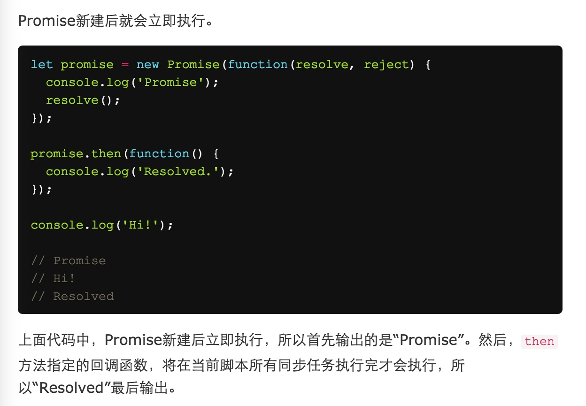

###Generator
- 返回一个遍历器对象,
- next方法的作用是分段执行 Generator函数.
- next 返回的是一个对象,*{done: ,value: }*
- next 还可以接受参数,向内输入数据.
- 使用指针对象的throw抛出错误, 可以实现error发出/捕获 时间和空间上的分离.
- "Thunk"函数就是一种传名调用的实现.
- js是传值调用,它的 "Thunk"实现是把多参函数 转成 单参函数.eg: `fs.readFile(a,cb)` => `fs.readFile(a)(cb)`
- Generator的函数自执行,就是在Genertor内yield后加入 需要输入异步函数 单参回调的函数, 在函数体外执行并 加入回调函数.

###Promise ->改变cb嵌套的写法
- Promise对象是一个构造函数,接受resolve和reject两个参数.内部是异步操作.
- Promise实例:`then`内的两个参数,是Promise 实例执行后的callback.
- *catch* 是then方法的特例.
- Promise实例被创建后 *立即执行*,然后,then方法指定的回调函数，将在当前脚本所有同步任务执行完才会执行，所以“Resolved”最后输出。

- *then* 方法返回的是一个新的Promise实例.

### Babel
- 在服务端prod时代码,尽量使用node 原生支持的.
- 在服务端开发时,尽量使用代码简洁的.
- 所以思考async -> generator
- `npm install babel-plugin-syntax-async-functions` ,支持babel去parse 这种语法
- `npm install babel-plugin-transform-async-to-generator`, async to *

###async
- await后面异步操作出错,等同于async函数返回的Promise对象被reject.
